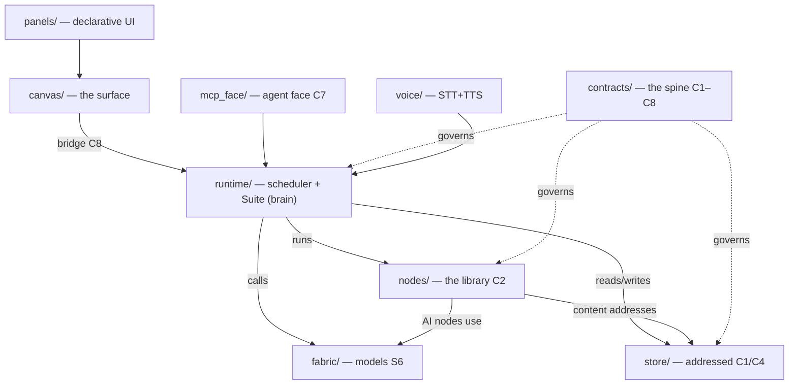

# MAP.md — the loadable map (Map of Contents)

The orientation an agent loads first, and the seed of the **linked code-knowledge** that becomes Tim's click-and-talk surface. As the code grows, this map is maintained *by the system about itself* (the reflective fold) — and a **drift-check fails loud** (`Suite.map_drift`, `tests/drift_acceptance.py`) when a registered node-type / RHM verb / subsystem isn't reflected here, so it can't silently rot.

> [!info] This file is the vault home. The repo is **also an Obsidian vault** — see [[Vault Conventions]]. Orientation order: [[Company — read first]] → **here** → [[Company State]] → the module's constitution.
> The **why** under all of it: [[Concepts and Principles]].

## The one picture
```
  canvas/  ── the surface you operate (React + tldraw) ───────────────────┐
     │  composes / sees / works-with / is EXTENDED through                │
     ▼                                                                    │  (the bridge, C8 / contracts/)
  runtime/ ── scheduler + memo + compile + the Suite (the brain) ─────────┤
     │  calls                                                             │
     ▼                                                                    │
  fabric/  ── the models (ollama/LiteLLM, OpenAI-compatible) + guards ────┘
  store/   ── where everything lives, by address (C1/C4) + events + chat + surfaced + panels
  mcp_face/── the agent face: generic verbs over all of it (C7); shares the Suite with the UI
  nodes/   ── the node library (process · content · presentation), each one C2
  voice/   ── two-way voice: STT (swappable provider; AssemblyAI/local) + TTS (local Kokoro, .voice-venv)
  panels/  ── brain-authored DECLARATIVE UI panels (JSON defs; the 'others' tier of self-mod)
  contracts/ ── the spine: the shapes all of the above compose against (C1–C8)
  canvas/app/src/extensions/ ── brain-authored ARBITRARY UI components (operator-only; build-gated)
```



## Module map (each links to its constitution + governing contracts)
| Module | One-line | Constitution | Governs |
|---|---|---|---|
| `contracts/` | the pinned shapes (the seams) | [[contracts — constitution]] | C1–C8 |
| `store/` | addressed store + resolver + events/chat/surfaced/panels | [[store — constitution]] | C1, C4 |
| `runtime/` | scheduler + memo + compile + the **Suite** (engine + RHM + self-mod) | [[runtime — constitution]] | S1, C5, C6, S7 |
| `fabric/` | model binding + guards + `list_models` (the model registry) | [[fabric — constitution]] | S6 |
| `mcp_face/` | agent face (generic verbs) | [[mcp_face — constitution]] | C7 |
| `nodes/` | the node library (incl. `portal`, `rhm_mode`, `model_of_tim`) | [[nodes — constitution]] | C2 |
| `voice/` | two-way voice — STT provider + local TTS | [[voice — constitution]] | — |
| `canvas/` | the frontend + the extensions runtime | [[canvas — constitution]] | S5, D3 |
| `panels/` | brain-authored declarative UI panels (JSON) | [[panels — constitution]] | — |
| `tests/` | acceptance suites (the proofs) | [[tests — constitution]] | — |
| `docs/` | meta-docs about the repo-as-knowledge-space | [[docs — constitution]] | — |
| `ops/` | the service **command center** — see + run the runtime (`company` console + `services.json`); first of more | [[ops — constitution]] | — |

> [!note] Constitution links use **aliases**, not filenames (every file is `AGENTS.md`). The alias `"<module> — constitution"` lives in each note's frontmatter — see [[Vault Conventions]]. Links to `panels/ · tests/` etc. resolve once [[Vault Conventions|the convention]] is applied to those folders.

## Live registry — the system's current capabilities
<!--REGISTRY:START--> (auto-maintained by Suite.refresh_self_description on every apply — do not hand-edit)
- **node-types** (16): ask, codebase, constant, embed, gate, join, llm, model_of_tim, pair, portal, retrieve, rhm_mode, similarity, titlecase, uppercase, wordcount
- **RHM verbs**: run, propose, build, consult, show, panel, extend, configure, load_voice, unload_voice, request_change
- **modes**: listening, text-only, background, focus, walkthrough, watch-and-react, decide-for-me, off
- **panels**: settings
- **models** (from the fabric registry): qwen3-embedding:0.6b, bge-m3:latest, qwen3.5-9b-q8:latest, qwen3.6-35b-a3b-iq3s:latest, minimax-m3:cloud, gemma4-26b-a4b-q3km:latest, qwen3.6-27b-q3km:latest, nomic-embed-text:latest, gemma4:31b-cloud, nemotron-3-super:cloud, deepseek-v4-flash:cloud, deepseek-v4-pro:cloud, kimi-k2.6:cloud, glm-5.1:cloud, glm-5:cloud, qwen3.5:397b-cloud, kimi-k2.5:cloud
<!--REGISTRY:END-->

## The Suite is the brain (runtime/suite.py) — one object, two faces (UI bridge + MCP)
Engine verbs: `create_node · connect · delete_node · set_config · run · state · results`. Introspection: `list_types · object_info · capabilities`. Surfaces: `now · events · inbox_lanes · coa`.
**The right-hand-man (RHM)** — the conversational voice (`chat`): grounded in live ground truth, abstains rather than confabulate, reasons from the explicit model-of-Tim (`nodes/model_of_tim.py` ← `foundation/system/principles.md`), grades turns gold/working. It ACTS only through a **whitelist of governed verbs** (`RHM_VERBS = run · propose · build · consult · show · panel · extend`); apply/delete/file-write are unreachable from it. Modes are nodes (`rhm_mode`, the presence dial); model/provider/persona are config; co-presence reads the operator's selection.

**The decision→implementation wire** (`runtime/implement.py` + `dispatch_decision`, Group W) closes *recorded decision → governed dispatch to Claude Code (`claude -p`, headless) → verify → result back → status=`implemented` **AND surfaced for review*** with no human re-prompt — reusing the `derived_from` bind (authorization), the event log (exactly-once, under a per-seq lock + the durable claim event + visibility), POLICY posture, and the separate `status` lane (closes without writing the operator `resolved` field). Only an `AUTO`-posture declared class auto-DISPATCHES (`decision_build`) — `AUTO` means auto-dispatch on the operator's approve (no second gate before building), it does **NOT** mean auto-CLOSE without review; CONFIRM/SURFACE/LOCKED classes surface for the operator before building; the close is `guard("code_build")`-ed on the verification verdict; an empty declared scope is deny-all. **GIT CHECKPOINT (Tim's safety mandate before arming): after all gates pass and BEFORE `implemented`, the wire commits EXACTLY the build's `changed_delta` as a single `[self-build] <sid>: <intent>` commit** (`_self_build_commit` → the shared `_git_self_commit` with a `[self-build]` prefix — reuse, not a parallel git path; path-scoped `git add <delta>` so a concurrent writer's unstaged dirty files are never swept in), so every accepted autonomous build is one `git revert <sha>` from undone (the same operator revert path as `[self-apply]`); the sha rides the item + `decision.implemented` event + review item. A commit failure (or empty delta) FAILS LOUD — surfaces back via a `decision.verify` terminal, never `implemented`. Proven by `wire_commit_acceptance.py`. **AI-operated is NOT review-free (AGENTS.md rule 9): every implemented build is SURFACED FOR REVIEW in the same guarded close** — a `decision.surfaced_for_review` event + a `build_result_review` inbox item (via the existing `surface_review`) carrying the result summary + the changed-files diff + `derived_from`, so the operator sees it in the RHM organ. `implemented` means "done AND surfaced for review", never a silent terminal. The review item is inert to the dispatcher (NOT a build-intent), so approving it reviews — it never triggers a rebuild. The build instruction (`build_instruction`) carries the STANDARDS (product UI/UX bar for any operator-facing surface; self-description updated as part of the change; a separate review pass + the operator will review) — it does NOT self-review. *Dispatch* is OFF the MCP face — the RHM surfaces a build-intent, it never dispatches one. The **production entry seam (T0-WIRE)** is `POST /api/build-intent` on the operator face (`bridge.py` → `surface_build_intent`), which only SURFACES the intent for the operator's `/api/resolve` approve; the WIRE-LOOP then dispatches it. The exactly-once `decision.dispatch` claim is FAIL-LOUD (`_emit_durable`, distinct from lenient telemetry `_emit` — T1-EMIT), and `append_event` seqs are atomic+unique under a store-level lock (T1-SEQ).

## Self-modification — update the app through its interface (governed, additive, git-reversible)
- **node-types** (`propose_node`→`apply_node`): the brain writes a `nodes/*.py`, operator approves, git-committed, auto-discovered.
- **declarative panels** (`propose_panel`→`apply_panel`): JSON field-defs in `panels/`, fields edit real config; the 'others' tier.
- **arbitrary code extensions** (`propose_extension`→`apply_extension`): a real `.tsx`, **build-GATED** (`_gate_extension` → `canvas/app/syntax-gate.cjs`, an **AST checker**: rejects non-`react` import/export specifiers, dynamic `import()`, `require()`, and external-URL literals — *not* a regex allowlist) OUTSIDE the live tree, promoted only on pass, then **lazy-loaded** (`import.meta.glob` → `lazy()`+`Suspense`) each inside an **error boundary** so a bad one degrades to a single dead panel, never a white screen; operator-only.
- every self-apply is a `[self-apply]` git commit → **revert recovers** (`revert_self_change`, conflict-aware: a non-tip revert that conflicts `git revert --abort`s + fails loud, leaving the repo CLEAN — never mid-revert). The **three** reversible autonomous-change streams — `[self-apply]` (self-mod), `[self-build]` (the decision→implementation wire's accepted-build checkpoint), **and** `[checkpoint]` (an OPERATOR-initiated restore point) — all undo through this one prefix-agnostic `revert_self_change`. The stream set is single-sourced (`Suite._SELF_CHANGE_STREAMS`): the classifier, the revert-tagger, AND the ledger's `--grep` net all derive from it, so a stream can't be added without the ledger seeing it (fail-loud one-source, rules 3+4).
- **operator checkpoint** (`Suite.checkpoint(paths, label)` → `POST /api/checkpoint`, operator-only): the operator stamps a *reversible restore point* of **named paths** ("checkpoint these files so I can experiment, and revert if it goes wrong") — the third reversible stream beside the two autonomous ones. **Path-scoped on purpose** (AGENTS.md rule 10 — Tim runs multiple sessions on `main`): it commits EXACTLY the named paths (`_git_self_commit` pathspec), so a concurrent session's unstaged in-flight work is NEVER swept in and a revert can never destroy it; a whole-tree checkpoint is **refused**. Three fail-loud guards (empty/whole-tree path-set · a path escaping the repo root · an empty delta — committing nothing is not a restore point). Off the MCP/agent face + NOT in `RHM_VERBS` (like `revert_self_change` — the RHM proposes/surfaces, it never commits of its own authority). Surfaces through the SAME ledger + workshop as the autonomous streams.
- **audit ledger** (`self_change_log` → `GET /api/self-change-log` + an MCP tool): the multi-entry reversible-change history across **ALL streams** (sha · subject · timestamp · **`stream`** ('self-apply'|'self-build'|'checkpoint') · `changed_files` · `is_revert`), newest-first, not just the single latest. `last_self_change` returns the newest still-standing change of **any** stream. A revert is tagged `is_revert` and **EXCLUDED from `last_self_change`** so an undo is never mistaken for a change (no "revert the revert" — generalized to every stream). *(Was: `[self-apply]`+`[self-build]`; and before that `[self-apply]` only — a `[self-build]` was revertible-by-sha but invisible to the ledger. Now every reversible autonomous change AND the operator's own checkpoints are visible AND one-click revertible from the one place.)*

## The path-of-least-resistance law (why the above is shaped this way)
Make the **correct action the AI's easiest path** — for BOTH the external agent (reads these AGENTS.md/MAP.md) AND the system's own self-coding brain (reads the authoring prompts). So: **the registry is the source of truth** (`capabilities()` — real models/node-types/verbs/panels feed every authoring prompt; registered select-options come from the registry, never a guess), **making things up is a failure** (= confabulation), and **when needed info isn't registered the brain ASKS** (`NEEDS:` → a surfaced `question`) rather than inventing.

## How a run flows
`canvas` (place+wire) → `compile` → `scheduler` (a node fires when its input **addresses** resolve in `store`) → AI nodes call `fabric` → results persist (content-addressed + provenance) → status/output back through the bridge → `canvas` re-renders. The MCP face drives every step; the RHM's context is the compact live state + model-of-Tim + the operator's selection.

## Self-growth (the point)
The system's first real use is its **own codebase** — this map + the code, indexed and linked, so Tim clicks and talks here and directs changes that dispatch back into these modules (governed). The interface is grown by being used on this. Vault: `Self-hosting first use — codebase as first source.md`, `RHM — Completion Criteria.md`, `Self-Coding Subsystem — Completion Criteria.md`.
