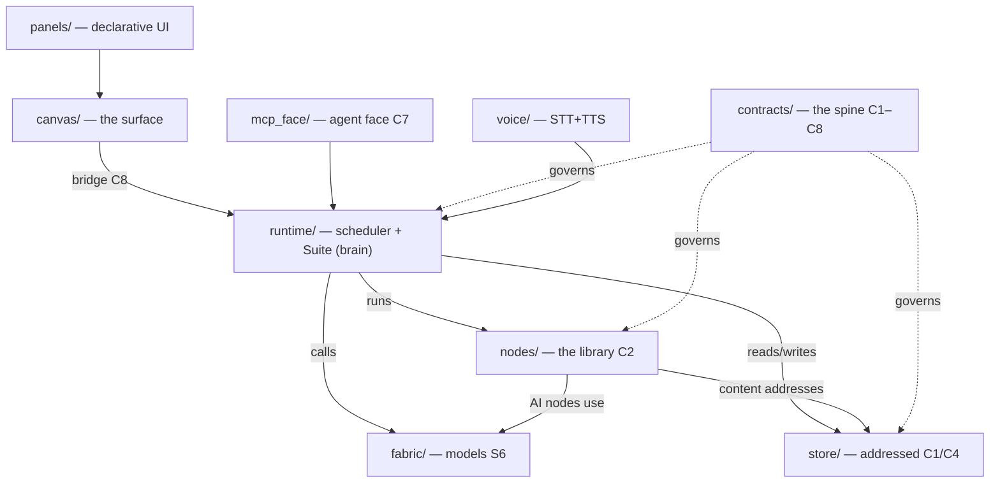

# MAP.md — the loadable map (Map of Contents)

The orientation an agent loads first, and the seed of the **linked code-knowledge** that becomes Tim's click-and-talk surface. As the code grows, this map is maintained *by the system about itself* (the reflective fold) — and a **drift-check fails loud** (`Suite.map_drift`, `tests/drift_acceptance.py`) when a registered node-type / RHM verb / subsystem isn't reflected here, so it can't silently rot.

> [!info] This file is the vault home. The repo is **also an Obsidian vault** — see [[Vault Conventions]]. Orientation order: [[Company — read first]] → **here** → [[Company State]] → the module's constitution.
> The **why** under all of it: [[Concepts and Principles]].

## The one picture
```
  canvas/  ── the surface you operate (React + tldraw) ───────────────────┐
     │  composes / sees / works-with / is EXTENDED through                │
     ▼                                                                    │  (the bridge, C8 / contracts/)
  runtime/ ── scheduler + memo + compile + the Suite (the brain) ─────────┤
     │  calls                                                             │
     ▼                                                                    │
  fabric/  ── the models (ollama/LiteLLM, OpenAI-compatible) + guards ────┘
  store/   ── where everything lives, by address (C1/C4) + events + chat + surfaced + panels
  mcp_face/── the agent face: generic verbs over all of it (C7); shares the Suite with the UI
  nodes/   ── the node library (process · content · presentation), each one C2
  voice/   ── two-way voice: STT (swappable provider; AssemblyAI/local) + TTS (local Kokoro, .voice-venv)
  panels/  ── brain-authored DECLARATIVE UI panels (JSON defs; the 'others' tier of self-mod)
  contracts/ ── the spine: the shapes all of the above compose against (C1–C8)
  canvas/app/src/extensions/ ── brain-authored ARBITRARY UI components (operator-only; build-gated)
```



## Module map (each links to its constitution + governing contracts)
| Module | One-line | Constitution | Governs |
|---|---|---|---|
| `contracts/` | the pinned shapes (the seams) | [[contracts — constitution]] | C1–C8 |
| `store/` | addressed store + resolver + events/chat/surfaced/panels | [[store — constitution]] | C1, C4 |
| `runtime/` | scheduler + memo + compile + the **Suite** (engine + RHM + self-mod) | [[runtime — constitution]] | S1, C5, C6, S7 |
| `fabric/` | model binding + guards + `list_models` (the model registry) | [[fabric — constitution]] | S6 |
| `mcp_face/` | agent face (generic verbs); `tools/introspection.py` = the `capability(op=list/get/search/describe/snapshot)` tool projecting from the CapabilityRegistry (Mirror-Registry LANE-PROJECTION) | [[mcp_face — constitution]] | C7, Mirror-Registry System |
| `nodes/` | the node library (incl. `portal`, `rhm_mode`, `model_of_tim`) | [[nodes — constitution]] | C2 |
| `voice/` | two-way voice — STT provider + local TTS | [[voice — constitution]] | — |
| `canvas/` | the frontend + the extensions runtime | [[canvas — constitution]] | S5, D3 |
| `panels/` | brain-authored declarative UI panels (JSON) | [[panels — constitution]] | — |
| `tests/` | acceptance suites (the proofs) | [[tests — constitution]] | — |
| `introspection/` | the platform-agnostic Mirror-Registry engine (DISCOVER→CLASSIFY→PROJECT→REFRESH over a `PlatformEntry` + the 5 closed rules) + the instance-#1 CLI adapters — Level-1, ZERO platform-name literals (the lift, F-FIX-10). **+ the two Level-2 registries (LANE-REGISTRIES):** `registry.py` = `CapabilityRegistry` (the binary-discovered capability-leaf table behind a CACHED singleton — `set_capability_registry`/`capability_registry()`, a NEW pattern justified by expensive discovery, F-FIX-1); `platforms.py` = `PlatformRegistry` (a standalone importlib copy loading `platforms/*.py` `PLATFORM` rows via `model_validate`, deriving transport_invariants at load) | [[introspection — constitution]] | Mirror-Registry System |
| `platforms/` | the Level-2 platform table as DATA — one `PLATFORM = {...}` row per external platform (`claude_code.py` = INSTANCE #1, Spec §7); DATA-ONLY, the legitimate home for platform-name strings the engine must never carry | [[platforms — constitution]] | Mirror-Registry System |
| `docs/` | meta-docs about the repo-as-knowledge-space | [[docs — constitution]] | — |
| `orienteering/` | the **terrain ledger** — what the Company is + where it physically lives (incl. the engines/data/config that run *outside* this folder) | [[orienteering — constitution]] (index: [[Orienteering Index]]) | — |
| `ops/` | the service **command center** — see + run the runtime (`company` console + `services.json`); first of more | [[ops — constitution]] | — |
| `ui-contract/` | the UI Contract corpus (the build's second product): purpose-free resource entries + transports/tasks/atlas a UI-building AI consumes INSTEAD of this repo's code — format frozen in `ui-contract/CONTRACT-FORMAT.md`; F1 slice carried, statuses honest (building/planned, nothing live until the driving harness flips it) | (README.md is its constitution) | F1.5/F9 |

> [!note] Constitution links use **aliases**, not filenames (every file is `AGENTS.md`). The alias `"<module> — constitution"` lives in each note's frontmatter — see [[Vault Conventions]]. Links to `panels/ · tests/` etc. resolve once [[Vault Conventions|the convention]] is applied to those folders.

## Live registry — the system's current capabilities
<!--REGISTRY:START--> (auto-maintained by Suite.refresh_self_description on every apply — do not hand-edit)
- **node-types** (16): ask, codebase, constant, embed, gate, join, llm, model_of_tim, pair, portal, retrieve, rhm_mode, similarity, titlecase, uppercase, wordcount
- **RHM verbs**: run, propose, build, consult, show, panel, extend, configure, load_voice, unload_voice, request_change
- **modes**: listening, text-only, background, focus, walkthrough, watch-and-react, decide-for-me, off
- **panels**: settings
- **models** (from the fabric registry): nomic-embed-code:latest, kimi-k2.7-code:cloud, qwen3-embedding:0.6b, bge-m3:latest, qwen3.5-9b-q8:latest, qwen3.6-35b-a3b-iq3s:latest, minimax-m3:cloud, gemma4-26b-a4b-q3km:latest, qwen3.6-27b-q3km:latest, nomic-embed-text:latest, gemma4:31b-cloud, nemotron-3-super:cloud, deepseek-v4-flash:cloud, deepseek-v4-pro:cloud, kimi-k2.6:cloud, glm-5.1:cloud, glm-5:cloud, qwen3.5:397b-cloud, kimi-k2.5:cloud
<!--REGISTRY:END-->

## The Suite is the brain (runtime/suite.py) — one object, two faces (UI bridge + MCP)
Engine verbs: `create_node · connect · delete_node · set_config · run · state · results`. Introspection: `list_types · object_info · capabilities`. Surfaces: `now · events · inbox_lanes · coa`.
**The right-hand-man (RHM)** — the conversational voice (`chat`): grounded in live ground truth, abstains rather than confabulate, reasons from the explicit model-of-Tim (`nodes/model_of_tim.py` ← `foundation/system/principles.md`), grades turns gold/working. It ACTS only through a **whitelist of governed verbs** (`RHM_VERBS = run · propose · build · consult · show · panel · extend`); apply/delete/file-write are unreachable from it. Modes are nodes (`rhm_mode`, the presence dial); model/provider/persona are config; co-presence reads the operator's selection.

**The decision→implementation wire** (`runtime/implement.py` + `dispatch_decision`, Group W) closes *recorded decision → governed dispatch to Claude Code (`claude -p`, headless) → verify → result back → status=`implemented` **AND surfaced for review*** with no human re-prompt — reusing the `derived_from` bind (authorization), the event log (exactly-once, under a per-seq lock + the durable claim event + visibility), POLICY posture, and the separate `status` lane (closes without writing the operator `resolved` field). Only an `AUTO`-posture declared class auto-DISPATCHES (`decision_build`) — `AUTO` means auto-dispatch on the operator's approve (no second gate before building), it does **NOT** mean auto-CLOSE without review; CONFIRM/SURFACE/LOCKED classes surface for the operator before building; the close is `guard("code_build")`-ed on the verification verdict; an empty declared scope is deny-all. **GIT CHECKPOINT (Tim's safety mandate before arming): after all gates pass and BEFORE `implemented`, the wire commits EXACTLY the build's `changed_delta` as a single `[self-build] <sid>: <intent>` commit** (`_self_build_commit` → the shared `_git_self_commit` with a `[self-build]` prefix — reuse, not a parallel git path; path-scoped `git add <delta>` so a concurrent writer's unstaged dirty files are never swept in), so every accepted autonomous build is one `git revert <sha>` from undone (the same operator revert path as `[self-apply]`); the sha rides the item + `decision.implemented` event + review item. A commit failure (or empty delta) FAILS LOUD — surfaces back via a `decision.verify` terminal, never `implemented`. Proven by `wire_commit_acceptance.py`. **AI-operated is NOT review-free (AGENTS.md rule 9): every implemented build is SURFACED FOR REVIEW in the same guarded close** — a `decision.surfaced_for_review` event + a `build_result_review` inbox item (via the existing `surface_review`) carrying the result summary + the changed-files diff + `derived_from`, so the operator sees it in the RHM organ. `implemented` means "done AND surfaced for review", never a silent terminal. The review item is inert to the dispatcher (NOT a build-intent), so approving it reviews — it never triggers a rebuild. The build instruction (`build_instruction`) carries the STANDARDS (product UI/UX bar for any operator-facing surface; self-description updated as part of the change; a separate review pass + the operator will review) — it does NOT self-review. *Dispatch* is OFF the MCP face — the RHM surfaces a build-intent, it never dispatches one. The **production entry seam (T0-WIRE)** is `POST /api/build-intent` on the operator face (`bridge.py` → `surface_build_intent`), which only SURFACES the intent for the operator's `/api/resolve` approve; the WIRE-LOOP then dispatches it. The exactly-once `decision.dispatch` claim is FAIL-LOUD (`_emit_durable`, distinct from lenient telemetry `_emit` — T1-EMIT), and `append_event` seqs are atomic+unique under a store-level lock (T1-SEQ).

**The session supervisor (`runtime/session_supervisor.py`, Session Fabric F1 · guide §A)** — the service that OWNS the supervised Claude Code fleet: N concurrent claude subprocesses under held-open stdin + `--input-format stream-json` (the T2-proven push tier), spawn/inject/interrupt/teardown over HTTP on **127.0.0.1:8771 only** (exposure law), per-session ndjson fan to `/watch` subscribers. Laws it carries: SINGLE WRITER of `agent_sessions.*` events on the shared log (the bridge + MCP face route fabric intents via the mailbox leaf `agent_sessions/mail.jsonl` and emit nothing fabric-shaped — the cross-process seq landmine's resolution by construction) · ENFORCED per-turn wall-clock watchdog (`COMPANY_FABRIC_TURN_TIMEOUT_S`, default 900 — a silent hang is reaped, the implement.py precedent, never ui_claude_session's dead constant) · concurrency cap `COMPANY_FABRIC_CONCURRENCY` (default 3) with TEACHING refusals · permission posture `COMPANY_FABRIC_PERMISSION` default `plan` · no orphans (SIGTERM/atexit teardown + the systemd cgroup). The verbs are routing decisions: DELIVER = inject into a live owned session · WAKE = spawn `--resume` on a non-live id · CONSULT = spawn `--resume --fork-session` N-fan (T4-proven non-destructive), all consumed from the mailbox with a per-consumer cursor ref (head-of-line hold = crash-safe ordering). Operator faces: `company session` (ops/cli/sessions.py) + the service row `session-supervisor` in `ops/services.json`. Spawn() is widened (CC-10/07.2/25.2/.3/18.7/33.4) via a pure `_build_spawn_cmd` cmd-builder threading optional model/effort/fallback/permission_mode/settings/add_dir/output_format/include_partial/debug/safe_mode/bare flags (byte-identical when unset, also on the `/spawn` body); `_turn_done` now captures the result event's cost/usage onto `agent_sessions.turn` (CC-20, was discarded). **Rail R1-prime — the `bridge-session` spawn PROFILE (Capability Fabric ④, 2026-06-12):** `spawn_bridge_session(...)` opens a CONSENT-GATED wider `--allowedTools` (Bash/git/LSP-Read-Edit-family/WebFetch/WebSearch + mcp__company) over the floor's mcp__company-only, for ④'s in-session git/LSP/web ops, via the pure `_build_bridge_session_cmd`/`_resolve_bridge_tools` builders + the `POST /bridge-session` route (+ `SUPERVISOR_ROUTES` row). The consent gate is consent-NOT-lockdown (Tim's sole-operator steer): the profile is always available, a wider spawn is refused-loud (403) without `operator_consent=true` (the /api/resolve operator-vantage beat), git-revert backstops. The allowlist is Atlas-grounded (`--allowedTools` specifier list; git→Bash, LSP→Read/Edit family); `computer`/`browser` are macOS+interactive-only host boundaries (Atlas computer-use.md) that can NEVER bind to a `-p`/WSL-Linux rail — refused-loud, never green. Results ride back as PROSE (liveness:stream, NO typed return_shape; git's structured-sha is the separate R3 rail). Proven by `tests/session_supervisor_acceptance.py` (27 service-level checks, stub-binary) + `tests/session_supervisor_params_acceptance.py` (53 checks: cmd-builder per-flag + byte-identical default + e2e usage capture + the R1.3 SPAWN_FLAGS registry); real-claude end-to-end + each flag-took-on-a-real-spawn is the lead's live-verify slice (the flipped contract ops carry an honest live-verify-pending note, never green-painted). **R1.2 — the render-declaration layer (2026-06-13):** every claude emit the reader parses is ALSO fanned as a `declared` event on `/watch` — `runtime/render_declaration.py` maps it through the typed-content registry `runtime/render_declarations.json` (closed vocabularies; placement/component/update-target/stream-accumulator/blocks-execution + a field_map extracting exactly what a UI draws; exact→family→bare→UNDECLARED lookup; assistant/user block sub-dispatch; unknown emits render LOUD as UnknownEvent and become `agent_sessions.render_drop` events — the registry's gap-pressure sensor). The consumer `ops/render_declared_stream.py` renders from declaration content only (`--scan-corpus` = the completeness gate: 2,514 real transcripts + the real T2 captures, 705k+ events, zero undeclared). **R1.3 — spawn-flag posture is REGISTRY-DERIVED (2026-06-14, LANE-SUPERVISOR-REFACTOR landed):** the remaining launch-flag surface threaded as `flags={…}` on both spawn bodies via the pure `_apply_spawn_flags`, whose POSTURE now DERIVES from the Mirror-Registry rules (`_registry_posture(flag)` → `rules.classify` over the claude-code signal_sets, swap-aware via R6) — the hand `SPAWN_FLAGS` posture dict is DELETED, the registry is the SOLE posture truth (F-FIX-5 steps 5-6). What remains is `SPAWN_FLAG_ASSEMBLY` (consumer-emission data only: flag-name/kind/teaching, NO posture). Derived breakdown: 23 safe · 8 consent (incl. `--add-dir` on the new `dirs` axis + the R6 swap-head-defaults `--allowedTools`/`--mcp-config`) · 17 locked. Cross-check 48/48 zero-divergence (the swap gate cleared; now a regression gate). `platforms/claude_code.py` is PURE DATA (the head_builder binding moved to `platforms/_wiring.py` — row-purity). **R1.1 — the live probe:** `ops/fabric_live_probe_r1.py` drives a real session through slash-command/tool-use/rewind-recorded + flag-effect legs in one command and prints the paste-ready proof summary (lead fires it).

**The ③④⑤ command-wrapper layer — REMOVED (Session Fabric R1.4, 2026-06-13).** The Capability-Fabric config/dev/auto handler families (`runtime/capability_handlers/` with its reduction registries + `r3` client), the R3 `config_writer` service (port 8772, unit + services.json row), their 18 MCP face tools (`mcp_face/tools/{config_authoring,dev_bridges,automation}.py`) and the 18 bridge `/api/config|dev|auto` arms were deleted: they hand-wrapped what a REAL Claude Code session already does natively (settings/hooks/mcp/plugin/git/gh/scheduling/auth via its own CLI) — the wrong-approach line in the Session Fabric Operational Requirements' honest ledger. The fabric drives real sessions instead (surface, don't rebuild): the kept seams are the session supervisor (incl. the R1-prime `bridge-session` consent-gated wider-allowlist spawn profile, which stays — it drives a real session, it doesn't wrap one), the session registry, the mailbox + verbs, the transcript exporter + search, and the R2 wire (`implement.py`). Verified at removal: all 18 bridge routes were catalogued to_build_ui orphans with NO front-end caller; the config-writer service was not running and its unit disabled; no non-wrapper code imported the deleted modules.

**The agent-session REGISTRY (Session Fabric F1.2 · guide §B)** — the fabric's memory of every Claude Code session, historical and live. `session://<id>` (id = the Claude session uuid) is a registered address scheme resolved to the session's durable registry record (`contracts/address.py` + `runtime/cognition.py:resolve_address` — sessions are addressable inputs like skills/contexts; `inspect_address` works on them for free). Identity lives as whole-record files under `<store>/agent_sessions/` (`FsStore.save_agent_session` et al — the save_journey atomic pattern, DISTINCT from the review-session `sessions/` dir); the live trajectory rides the closed `AGENT_SESSION_OPS` event set (`agent_sessions.*` in `runtime/suite.py` — the ENGINE_RUN_OPS mirror; the canonical emit shape is declared beside it); `Suite.list_agent_sessions`/`get_agent_session` is the log-IS-the-index fold joining both (records = identity by mtime-delta · log = state/last_activity past a high-water seq · cross-process convergent · the CANONICAL-ID rule maps the supervisor's `as-…` local handles onto catalog uuids, fork-safe per T4). The historical catalog is backfilled by the READ-ONLY importer `ops/agent_sessions_importer.py` (1,065 sessions; the exact F1.2 title fallback chain; CC-internal summarizer one-shots marked `summarizer:true` — ~72% of the catalog is machine sessions, `include_summarizers=False` filters to the ~293 real conversations). The F1.3 `sessions` MCP tool's list/describe ops read this fold. Proven by `tests/agent_sessions_registry_acceptance.py` (37 checks) + the real backfill.

**The capability REGISTRY is addressable (Mirror-Registry LANE-CAP-WIRE)** — `cap://<kind>/<id>` (e.g. `cap://flag/--debug`, `cap://tool/Bash`) is a registered address scheme resolved through `runtime/cognition.py:resolve_address` to a `CapabilityEntry` — the live binary's self-reported flag/slash/tool/setting leaf. The resolver reaches the rows via the CACHED `introspection.registry.capability_registry()` singleton that `Suite.__init__` installs (a NEW pattern, F-FIX-1: binary discovery is too expensive to repeat per-resolution). DISCOVERY IS DEFERRED — `__init__` installs an EMPTY registry (no `claude` spawn at construction); a LEAD run populates it via `Suite.discover_capabilities()` (or `COMPANY_CAP_DISCOVER_AT_INIT=1`), and until then `cap://` RAISES "unknown capability" (registry-is-truth, never fabricates). `Suite.capabilities()['introspection']` projects the same registry (counts by kind/posture + version + platform). The Mirror-Registry's first production effect. Proven by `tests/cap_wire_acceptance.py` (14 checks, stub-populated — no live claude); the live-binary leg is 🟡 lead-verify queued (C-WIRE-1/2/3).

**Search→handle→act — a search hit is a LIVE handle (Session Fabric R4.2–R4.5 · research lane 5)** — `runtime/session_search.py` + `sessions(op='search')` (`mcp_face/tools/sessions.py`): content search over the session-transcript corpus index (the claude-sessions substrate state dir, read straight from its sqlite) whose every result is joined AT QUERY TIME onto the live registry → `{session_id, session://, name, title, summarizer, state-now, cwd, point (turn/speaker/anchor/chunk_address — the R3.4 launch-at-point adapter's input), snippet, primary_verb (what session_post(verb='auto') would route NOW — the same rule, shown), commands (runnable session_post + channel_act gather/add forms)}`. Two modes in the declared `MODES` registry (R11 heart frame): **lexical** (the index's own chunk text, zero models, always on) + **semantic** (pplx-embed; the vector query bridges to the overlord venv by subprocess — the 2-stage-rerank venv-bridge precedent; embedder down = TEACHING raise naming `company up embed-pplx`, never a silent empty); `mode='auto'` declares `mode_used`. Unroutable corpus hits return `routable:false` + the registry's own error (honest, never dropped). PURE READ (the floor): acting on a handle is `session_post`/`channel_act`'s second deliberate step; only the supervisor executes. Index provenance (files/chunks/embed-coverage) is DECLARED on every envelope — the interim transcript index is swappable at this ONE seam when the real memory system lands. Teeth: `tests/session_search_acceptance.py` (24 checks vs the live index+registry) + `tests/session_search_mcp_stdio_probe.py` (a raw JSON-RPC stdio client = a real MCP agent walking search→handle→consult-post→gather→post→disperse against the real `mcp_face/server.py`; `--act` is the deliberate write run). Lead live-probes queued: the semantic leg's live fire (embedder was down at proof time) + the supervisor executing the queued seq-17 consult.

**Point-in-time launch (`runtime/session_pointintime.py`, Session Fabric R3.3/R3.4)** — view any session's life as a COMPACTION TIMELINE and launch/message it AS IT WAS at any moment. The transcript is append-only, so moment T = a line-prefix of today's file; `build_timeline` indexes the real distinct compactions (payload boundary-copies deduped; both measured post-compact-head eras) into a cached registry record (`agent_sessions/timeline/<sid>.json` via `Suite.agent_session_timeline`, face `sessions(op='timeline')`); `materialize_at_point` applies the NATIVE fork transform (sessionId rewrite + deterministic uuid5 remap + forkedFrom provenance — Atlas session-storage.md) to the prefix at the cut, writing ONE NEW wake-ready session file beside the source (source byte-untouched law, fail-loud); `session_post(at='compact:N'|'uuid:…'|'ts:…')` rides wake/consult intents (deliver+at refused; bounds refuse at post time) and the supervisor's `_at_launch` materializes → registers (provenance fields) → spawns `--resume <copy>` in the cwd that ENCODES to the project dir (`resume_cwd_for` — the drifted-cwd hazard's guard); consult fans N independent materializations. Teeth: `tests/session_pointintime_acceptance.py` (40 checks incl. the real service consuming at-intents vs the stub binary). The live resume-at-point probe is the lead's (a materialized real point sits registered: `aa38004f…` = `7c2c1b74…@compact:20`).

## Self-modification — update the app through its interface (governed, additive, git-reversible)
- **node-types** (`propose_node`→`apply_node`): the brain writes a `nodes/*.py`, operator approves, git-committed, auto-discovered.
- **declarative panels** (`propose_panel`→`apply_panel`): JSON field-defs in `panels/`, fields edit real config; the 'others' tier.
- **arbitrary code extensions** (`propose_extension`→`apply_extension`): a real `.tsx`, **build-GATED** (`_gate_extension` → `canvas/app/syntax-gate.cjs`, an **AST checker**: rejects non-`react` import/export specifiers, dynamic `import()`, `require()`, and external-URL literals — *not* a regex allowlist) OUTSIDE the live tree, promoted only on pass, then **lazy-loaded** (`import.meta.glob` → `lazy()`+`Suspense`) each inside an **error boundary** so a bad one degrades to a single dead panel, never a white screen; operator-only.
- every self-apply is a `[self-apply]` git commit → **revert recovers** (`revert_self_change`, conflict-aware: a non-tip revert that conflicts `git revert --abort`s + fails loud, leaving the repo CLEAN — never mid-revert). The **three** reversible autonomous-change streams — `[self-apply]` (self-mod), `[self-build]` (the decision→implementation wire's accepted-build checkpoint), **and** `[checkpoint]` (an OPERATOR-initiated restore point) — all undo through this one prefix-agnostic `revert_self_change`. The stream set is single-sourced (`Suite._SELF_CHANGE_STREAMS`): the classifier, the revert-tagger, AND the ledger's `--grep` net all derive from it, so a stream can't be added without the ledger seeing it (fail-loud one-source, rules 3+4).
- **operator checkpoint** (`Suite.checkpoint(paths, label)` → `POST /api/checkpoint`, operator-only): the operator stamps a *reversible restore point* of **named paths** ("checkpoint these files so I can experiment, and revert if it goes wrong") — the third reversible stream beside the two autonomous ones. **Path-scoped on purpose** (AGENTS.md rule 10 — Tim runs multiple sessions on `main`): it commits EXACTLY the named paths (`_git_self_commit` pathspec), so a concurrent session's unstaged in-flight work is NEVER swept in and a revert can never destroy it; a whole-tree checkpoint is **refused**. Three fail-loud guards (empty/whole-tree path-set · a path escaping the repo root · an empty delta — committing nothing is not a restore point). Off the MCP/agent face + NOT in `RHM_VERBS` (like `revert_self_change` — the RHM proposes/surfaces, it never commits of its own authority). Surfaces through the SAME ledger + workshop as the autonomous streams.
- **audit ledger** (`self_change_log` → `GET /api/self-change-log` + an MCP tool): the multi-entry reversible-change history across **ALL streams** (sha · subject · timestamp · **`stream`** ('self-apply'|'self-build'|'checkpoint') · `changed_files` · `is_revert`), newest-first, not just the single latest. `last_self_change` returns the newest still-standing change of **any** stream. A revert is tagged `is_revert` and **EXCLUDED from `last_self_change`** so an undo is never mistaken for a change (no "revert the revert" — generalized to every stream). *(Was: `[self-apply]`+`[self-build]`; and before that `[self-apply]` only — a `[self-build]` was revertible-by-sha but invisible to the ledger. Now every reversible autonomous change AND the operator's own checkpoints are visible AND one-click revertible from the one place.)*

## The path-of-least-resistance law (why the above is shaped this way)
Make the **correct action the AI's easiest path** — for BOTH the external agent (reads these AGENTS.md/MAP.md) AND the system's own self-coding brain (reads the authoring prompts). So: **the registry is the source of truth** (`capabilities()` — real models/node-types/verbs/panels feed every authoring prompt; registered select-options come from the registry, never a guess), **making things up is a failure** (= confabulation), and **when needed info isn't registered the brain ASKS** (`NEEDS:` → a surfaced `question`) rather than inventing.

## How a run flows
`canvas` (place+wire) → `compile` → `scheduler` (a node fires when its input **addresses** resolve in `store`) → AI nodes call `fabric` → results persist (content-addressed + provenance) → status/output back through the bridge → `canvas` re-renders. The MCP face drives every step; the RHM's context is the compact live state + model-of-Tim + the operator's selection.

## Self-growth (the point)
The system's first real use is its **own codebase** — this map + the code, indexed and linked, so Tim clicks and talks here and directs changes that dispatch back into these modules (governed). The interface is grown by being used on this. Vault: `Self-hosting first use — codebase as first source.md`, `RHM — Completion Criteria.md`, `Self-Coding Subsystem — Completion Criteria.md`.
